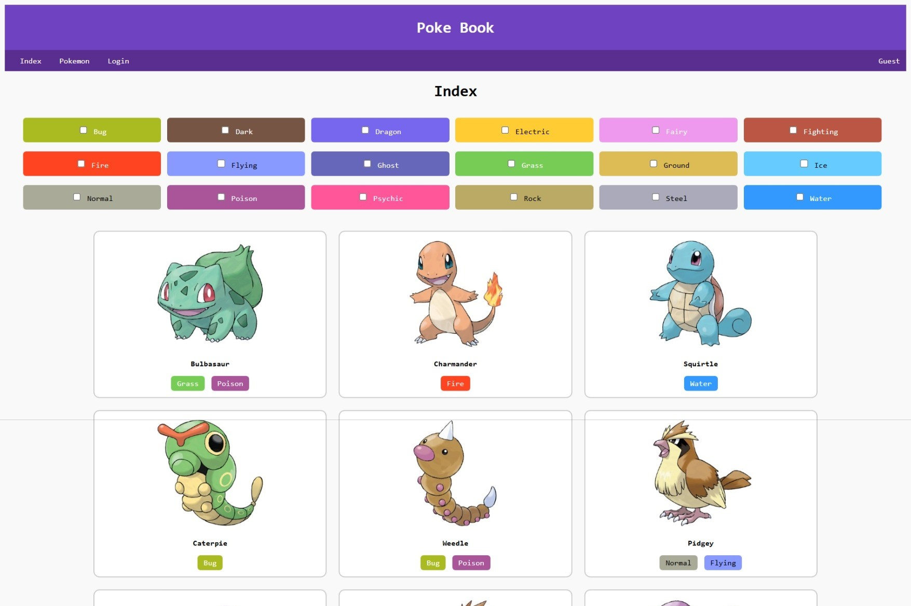
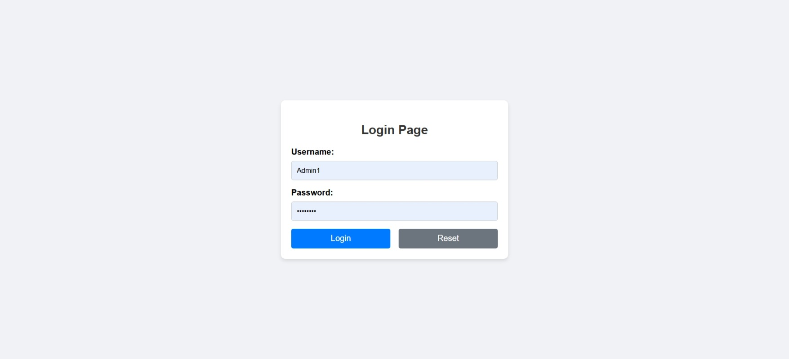
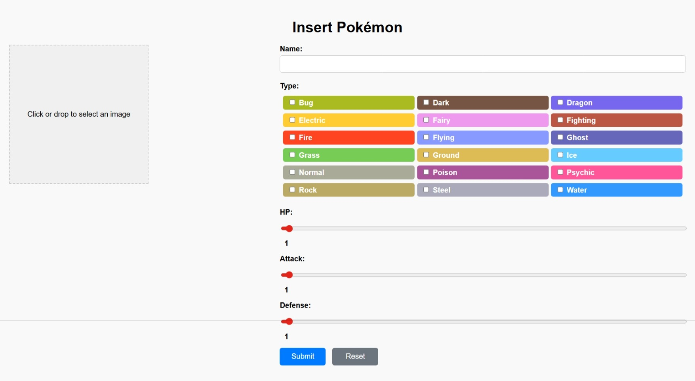
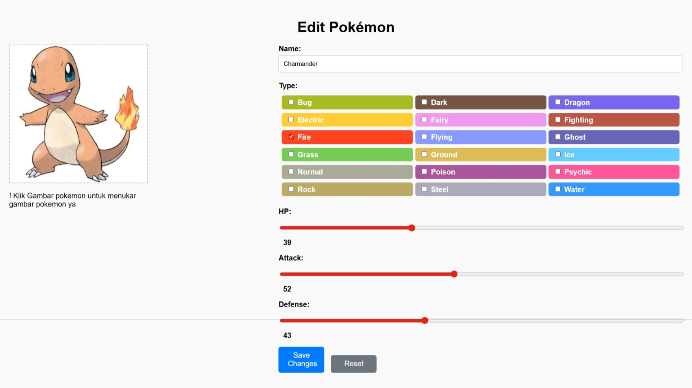

# PokeBook Web Application

**Project Overview**
Poke Book is a web application built using **PHP 8**, **Laravel framework**, and **MySQL** for managing and displaying Pokémon characters. The system allows **admins** to insert, update, and delete Pokémon records while **guest users** can view Pokémon details.

This project was developed under a **XAMPP environment**, with **jQuery** used for front-end interactivity.



---

## Features

### 1. User Authentication

* **Login / Logout** system for admins.
* Admin credentials are stored in **SHA1 hashed passwords** in the `admins` table.
* Shows **user role** (Guest or Admin) in the navigation menu.

### 2. Index Page

* Displays all Pokémon with **filtering options** using checkboxes for 18 Pokémon types.
* Each Pokémon shows **image, name, and type indicators** (colored circles based on `type-color.txt`).
* Pokémon records are clickable and redirect to the **Pokémon detail page**.

### 3. Pokémon Detail Page

* Shows Pokémon details: **ID, name, type, HP, attack, and defense**.
* Stats are visualized using **colored horizontal bars**:

  * 1–30 → Red
  * 31–60 → Orange
  * 61–90 → Yellow
  * 91–120 → Green
* Navigation arrows to view **previous/next Pokémon** in circular mode.
* **Admin users** see **Edit** and **Delete** buttons.

### 4. Admin Management Pages

* **Insert Page**: Admins can add new Pokémon with image upload.

  * Supports **click-to-select** and **drag-and-drop** image upload.
  * Images are cropped and resized to **300x300 px** and saved as `.jpg` using Pokémon ID as filename.
  * HP, Attack, Defense inputs use **sliders**.
* **Edit Page**: Admins can update Pokémon information and images.
* **Delete Function**: Admins can remove Pokémon records and images.

### 5. Design

* Simple, clean, and user-friendly layout with **header, navigation, and main content** areas.
* Includes **hover effects**, clear error messages, and responsive form validations.

| Pokemon Page (Guest) | Pokemon Page (Admin)  |
| :---: | :---: |
| .jpeg) | .jpeg) |
| **Login Page** | **Add Pokemon Page** |
|  |  |
| **Edit Pokemon Page** | **Confirm Delete** |
|  |  |
---

## Database Structure

### `admins` Table

| Field    | Type         | Notes                 |
| -------- | ------------ | --------------------- |
| username | VARCHAR(20)  | Primary key, not null |
| password | VARCHAR(255) | SHA1 hash, not null   |

**Sample Records**

* `Admin1` / password (SHA1)
* `Admin2` / password (SHA1)

### `pokemons` Table

| Field   | Type         | Notes                       |
| ------- | ------------ | --------------------------- |
| id      | INT          | Primary key, auto-increment |
| name    | VARCHAR(255) | Not null                    |
| type1   | VARCHAR(255) | Not null                    |
| type2   | VARCHAR(255) | Not null                    |
| hp      | INT          | Not null                    |
| attack  | INT          | Not null                    |
| defense | INT          | Not null                    |

* Import **50 Pokémon records** from `pokemon.csv`.
* Images stored in the `pokemon` folder, named by Pokémon ID.

---

## Installation / Setup

1. Install **XAMPP** (Apache + MySQL + PHP 8).
2. Place project folder in `htdocs` as `CompetitorID_Module_C`.
3. Import `pokemons.csv` into **MySQL** database.
4. Configure `.env` file for database connection:

```env
DB_CONNECTION=mysql
DB_HOST=127.0.0.1
DB_PORT=3306
DB_DATABASE=pokebook
DB_USERNAME=root
DB_PASSWORD=
```

5. Run migrations / seeders if using Laravel.
6. Open project in browser: `http://localhost/CompetitorID_Module_C/public`

---

## Usage

* Guest users can **browse Pokémon** and filter by type.
* Admin users can **login**, manage Pokémon records, and upload new images.
* Logout redirects back to the **index page**.

---

## Project Structure

```
CompetitorID_Module_C/
├─ app/                # Laravel application files
├─ public/             # Public assets (CSS, JS, images)
│   └─ pokemon/        # Pokémon images
├─ resources/views/    # Blade templates for pages
├─ routes/             # Web routes
├─ database/           # Migrations & seeders
├─ type-color.txt      # Pokémon type colors
└─ pokemon.csv         # Pokémon dataset
```

---

## Technologies

* PHP 8 (Laravel 11.x)
* MySQL
* jQuery
* HTML5, CSS3, JavaScript
* XAMPP for local development

---

## Notes

* Ensure all uploaded images are **JPG format** and resized to **300x300 px**.
* Filtering on index page uses **AND logic** for multiple type selections.
* Admin features are **restricted** and require login to access.

